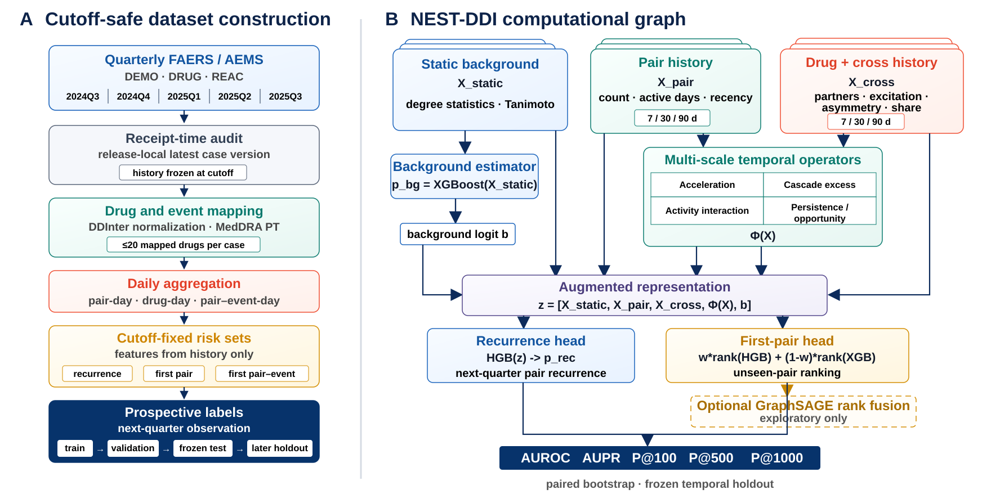

# NEST-DDI

Code and data repository for:

> **NEST-DDI: Auditable Temporal Modeling for Prospective Drug–Drug Interaction Report Monitoring**
> Qian Zhao, Zhensong Wang, Juan Wang — ICASSP 2027 submission



*Figure 1 — NEST-DDI overview: receipt-time-safe construction of rolling quarterly panels, and the NEST-DDI ranking pipeline.*

| Resource | Link |
|---|---|
| Paper (PDF) | [`nest_ddi_icassp2027_short_v2.pdf`](nest_ddi_icassp2027_short_v2.pdf) |
| Figure 1 (vector) | [`figures/nest-ddi-framework-reproduced.pdf`](figures/nest-ddi-framework-reproduced.pdf) · [`figures/nest-ddi-framework-reproduced.svg`](figures/nest-ddi-framework-reproduced.svg) |
| Figure 1 (source) | [`figures/nest-ddi-framework-reproduced.drawio`](figures/nest-ddi-framework-reproduced.drawio) |

## What this repository contains

A cutoff-safe evaluation benchmark for prospective pharmacovigilance DDI monitoring, together with the NEST-DDI model and a matched baseline suite. Instead of splitting a curated interaction table at random, the benchmark fixes the candidate risk set and the available information *before* each future quarter, then asks which drug pairs are actually reported next. The protocol separates three distinct targets that are usually conflated:

| Task | Question | Positive rate (2024Q3 cutoff) |
|---|---|---|
| **Pair-report recurrence** | Is a previously observed pair reported again next quarter? | 17,804 / 93,194 |
| **First-pair report** | Does a pair with no previous report receive its first report? | 4,118 / 93,194 |
| **First pair–event discovery** | Does an unseen pair–MedDRA PT triplet occur? | sampled case–control |

The companion model, NEST-DDI, combines a static structural background with multi-scale report history through deterministic temporal operators. All tabular and historical-graph comparisons share a common feature contract, and graph edges use historical co-medication only.

> **Scope.** This is an evaluation protocol and a matched baseline suite, not a causal DDI predictor. FAERS/AEMS co-medication reports are time-stamped observations of a *reporting process* — they are not exposure-normalized incidence. See [Interpretation boundaries](#interpretation-boundaries).

## Headline results

Frozen release-local leaderboard. **AUPR is the primary metric**; precision@K saturates at 1.00 for most methods and is therefore uninformative here. `†` marks a prospective binary adaptation whose original checkpoint or multi-class label contract differs from this benchmark.

| Method | Rec-AUROC | Rec-AUPR | First-AUROC | First-AUPR |
|---|---:|---:|---:|---:|
| Recency–popularity | 0.9762 | 0.89444 | 0.8991 | 0.13253 |
| DRIFT-Temporal `†` | 0.87124 | 0.57142 | 0.72649 | 0.04116 |
| DrugDAGT-Temporal `†` | 0.56954 | 0.15807 | 0.53672 | 0.01751 |
| SMR-DDI-Temporal `†` | 0.86529 | 0.55594 | 0.66384 | 0.03205 |
| ExtraTrees | 0.9776 | 0.90192 | 0.9018 | 0.13776 |
| HGB | 0.97810 | 0.90437 | 0.90384 | 0.14570 |
| FT-Transformer | 0.97831 | 0.90448 | 0.90568 | 0.14387 |
| **NEST-DDI** | **0.97832** | **0.90520** | 0.90407 | **0.14870** |

The recurrence gain over HGB is **small but consistent**: +0.00090 AUPR (95% CI 0.00062–0.00120) and +0.00022 AUROC on the frozen 2025Q1→2025Q2 test, replicated on the later 2025Q2→2025Q3 holdout at +0.00110 AUPR (95% CI 0.00081–0.00139). Paired uncertainty uses 300 stratified bootstrap resamples.

A fixed equal-rank NEST–GraphSAGE fusion improves first-pair ranking to **AUPR 0.16407 / AUROC 0.90964** (+0.01468 AUPR, 95% CI [0.01103, 0.01850] over optimized NEST). These fusion results are exploratory and were not used to tune recurrence.

### Feature ablation (frozen recurrence panel)

| Variant | AUPR |
|---|---:|
| NEST-DDI (full) | 0.90526 |
| − all decayed history | 0.90524 |
| − static structural background | 0.90358 |
| − drug-level analogues | 0.90377 |
| Static structural background only | 0.55045 |

Removing any single auxiliary channel moves AUPR by at most 0.0017 — the decay/acceleration channels add 0.00002 beyond the recency counts, the structural background 0.00168, and the drug-level aggregates 0.00150. The static background alone reaches only 0.55045, so report history carries nearly all of the ranking signal. The reproducible runner is [`scripts/run_nest_ablation.py`](scripts/run_nest_ablation.py); the recorded run, with the dropped-column list of every variant, is [`results/nest_ddi/ablation_release_local_metrics.json`](results/nest_ddi/ablation_release_local_metrics.json).

### Additional evidence

- **Later holdout (2025Q2→2025Q3):** AUPR 0.91285 vs 0.91174 for HGB.
- **Calibration:** Brier 0.03301 / ECE 0.00346, versus 0.03334 / 0.00688 for HGB — calibration is reported separately from discrimination.
- **Seed sensitivity:** FT-Transformer first-pair AUPR 0.14387 / 0.14665 across seeds 42 and 7; GraphSAGE fusion 0.15039 / 0.15353. Recurrence AUPR moved by <0.001.
- **Sampling sensitivity:** on 1:10 case–control samples a fixed scorer gives AUROC 0.74320 / 0.74317, while sampled AUPR is 0.20848 / 0.20847. AUROC is the safer cross-sample comparison.
- **Negative control:** historical pair–event count reaches AUPR 0.85475 while Ω₀₂₅ reaches 0.68464 — counting predicts re-reporting, not unseen-triplet discovery.
- **Reporting-role strata (later holdout):** NEST − HGB AUPR difference is 0.00052 (suspect–suspect), 0.00049 (concomitant–concomitant), 0.00130 (suspect–concomitant). The gain is not invariant to reporting role, and some small strata favor HGB.
- **Operational capacity:** at the top 10,000 / 50,000 the later holdout adds +1 / +59 observed positives over HGB. A cutoff-dated openFDA label-text audit mentions 27 of NEST-DDI's top 300 pairs versus 31 for HGB — label absence is not a negative.

## Benchmark construction

Quarterly FAERS/AEMS ASCII releases, 2024Q3 through 2025Q3. Within each release only the latest case version is retained, so later releases cannot rewrite historical features. Drug names are normalized to the DDInter inventory, cases with more than 20 mapped drugs are excluded, and each case contributes unique unordered drug pairs and MedDRA preferred terms.

| Cutoff | Cases | Pairs | Recurrence+ | First+ |
|---|---:|---:|---:|---:|
| 2024Q3 | 162,538 | 93,194 | 17,804 | 4,118 |
| 2024Q4 | 173,234 | 97,943 | 18,226 | 4,506 |
| 2025Q1 | 169,726 | 94,655 | 19,041 | 4,772 |
| 2025Q2 | 162,600 | 92,631 | 19,388 | — |

The candidate universe is fixed from the DDInter inventory; labels are opened only in the following quarter. The ratio of future positives is therefore a property of the reporting process, not a chosen class balance. The release-local pair-day file contains 3,005,177 rows and 177,902 observed pairs.

**Protocol.** Rolling cutoffs 2024Q3, 2024Q4 and 2025Q1 define next-quarter folds; 2025Q1→2025Q2 is the **frozen test**; 2025Q2→2025Q3 is a later holdout evaluated with all choices frozen. Matched tabular and historical-graph comparisons share a common **41-feature contract**. Graph edges use historical co-medication only.

**Version policy.** All panels are built `release_local`: a feature may only use information contained in the quarterly release that precedes its cutoff.

## Repository layout

```
nest-DDI/
├── environment_temporal.yml     # conda environment specification
├── figures/                     # manuscript framework figure (SVG + vector PDF + draw.io source)
├── scripts/                     # data builders, model runners, baseline suites, audits
├── src/ddi/                     # DDInter dataset builder + PubChem SMILES fetcher
├── results/nest_ddi/            # machine-readable metrics (JSON) and score arrays, one file per run/audit
├── nest_ddi_icassp2027_short_v2.pdf   # manuscript
└── README.md
```

`results/nest_ddi/` holds 51 artifacts (metrics JSON + score `.npz`/`.parquet`); the row-level panels behind them are not redistributed.

Key records:

- [`scripts/build_nest_release_manifest.py`](scripts/build_nest_release_manifest.py) — declares the release scope and recomputes a SHA-256 checksum for every released file.
- [`scripts/audit_submission_readiness.py`](scripts/audit_submission_readiness.py) — submission-readiness gate over the frozen artifacts.
- [`results/nest_ddi/all_baseline_leaderboard_audit.json`](results/nest_ddi/all_baseline_leaderboard_audit.json) — baseline leaderboard audit record.
- [`results/nest_ddi/rerun_main_2026_metrics.json`](results/nest_ddi/rerun_main_2026_metrics.json) — the recurrence and first-pair run behind Table 1.
- [`results/nest_ddi/ablation_release_local_metrics.json`](results/nest_ddi/ablation_release_local_metrics.json) — feature-group ablation on the frozen recurrence panel, listing the dropped columns of every variant.

## Data

`data/` is **not** tracked in git. **Raw FAERS/AEMS records are not redistributed in this repository.** They are obtained from the FDA under the original distribution terms:

- FDA Adverse Event Monitoring System (AEMS) / FAERS Quarterly Data Extract Files — <https://fis.fda.gov/extensions/FPD-QDE-FAERS/FPD-QDE-FAERS.html>

Place each quarterly ASCII release so that the tree resolves as:

```
data/processed/
├── faers_2024q3/ … faers_2025q3/   # quarterly ASCII releases (not cumulative)
├── ddinter_drugs.csv               # normalized drug inventory
├── ddinter_pairs.csv               # reference interaction table (used for independence auditing only)
├── ddinter_smiles.json             # PubChem SMILES cache
├── nest_ddi_pilot_audit_4q_release.json       # Table 3 counts (cases, pairs, rows)
└── nest_ddi_prediction_panel_4q_release.parquet   # rolling-cutoff prediction panel
```

Derived row-level panels and case-level outputs are not redistributed; they are rebuilt from the raw quarters by the scripts above. Drug-name normalization follows the DDInter inventory; independent label-text checks use the [openFDA drug labeling API](https://open.fda.gov/apis/drug/label/). This repository ships derived metric summaries as JSON only.

## Requirements

```bash
conda env create -f environment_temporal.yml
conda activate ddi-temporal-obspu
```

Python 3.12.4, PyTorch 2.5.1, scikit-learn 1.9.0, pandas 2.2.2, NumPy 1.26.4, RDKit 2025.03.3. DGL is intentionally omitted from the core environment: the released temporal scripts use a local PyTorch molecular-graph implementation, and the original DGL/SumGNN launcher requires a platform-specific GraphBolt binary that is not part of the reproducibility contract.

## Running

### Path contract

The scripts currently hardcode

```python
ROOT = Path(r"D:\BI\DDI")
```

at the top of each file, with `DATA = ROOT / "data" / "processed"` and `OUT = ROOT / "results" / "nest_ddi"`. Before running anywhere else, update `ROOT` (and the `DATA`/`OUT` derivations that follow it) to your checkout location. `scripts/plot_icassp_figures.py` writes to `D:\BI\DDI\figures`.

### Output locations

Every runner writes one JSON (and, where scores are needed for paired bootstrap or figure regeneration, one `.npz`) into `results/nest_ddi/`, named `<output-tag>_metrics.json`. The tag is a CLI argument (`--output-tag`) or a module-level constant, so re-running a suite overwrites its own record and nothing else.

### Ordered reconstruction

```bash
# 1. Build dated pair and pair-event records, then the prediction panels
python scripts/build_nest_pilot.py
python scripts/build_nest_prediction_panel.py
python scripts/build_nest_pv_sufficient_statistics.py

# 2. Pair-report baseline suites
python scripts/run_nest_baselines.py
python scripts/run_nest_extended_baselines.py
python scripts/run_nest_final_comparison.py

# 3. Deep and historical-graph baselines
python scripts/run_nest_deep_learning_baselines.py --epochs 8 --batch-size 4096 --seed 42
python scripts/run_nest_graph_deep_baselines.py --epochs 6 --batch-size 16384 --seed 42
python scripts/audit_graph_deep_bootstrap.py

# 4. First pair–event discovery and the later holdout
python scripts/run_nest_first_event_baselines.py --input-tag release_local --output-tag first_event_baseline_release_local
python scripts/run_nest_later_temporal_test.py --input-tag 5q_release --output-tag later_temporal_release_local

# 5. Feature ablation (frozen recurrence panel)
python scripts/run_nest_ablation.py

# 6. Release gate
python scripts/build_nest_release_manifest.py
python scripts/audit_submission_readiness.py
```

Random seeds are 42 unless a script argument or the output audit states otherwise. The reconstruction contract lists the required audit outputs and their expected locations.

## Code map

### Data construction

| File | Lines | Purpose |
|---|---:|---|
| `build_nest_pilot.py` | 216 | quarterly case/pair reconstruction → `nest_ddi_pilot_audit*.json` |
| `build_nest_prediction_panel.py` | 128 | rolling-cutoff prediction panels → `nest_ddi_prediction_panel_*.parquet` |
| `build_nest_first_event_discovery.py` | 155 | pair–event triplet construction for the discovery task |
| `build_nest_pv_sufficient_statistics.py` | 106 | pharmacovigilance sufficient statistics (negative-control Ω) |
| `run_nest_original.py` | 201 | shared library: feature contract (`STATIC`, `RAW_DYNAMIC`, `engineer()`), metric helpers, static background model; imported by the runners |

### Model runners

| File | Lines | Purpose |
|---|---:|---|
| `run_nest_baselines.py` | 125 | classical pair-report baselines |
| `run_nest_extended_baselines.py` | 166 | extended suite — recency–popularity, ExtraTrees, historical-co-medication variants |
| `run_nest_final_comparison.py` | 128 | frozen comparison producing the HGB / NEST-DDI rows of Table 1 |
| `run_nest_2026_baselines.py` | 105 | 2026 deep tabular baselines (FT-Transformer, Wide&Deep, DeepFM, …) |
| `run_nest_deep_learning_baselines.py` | 249 | MLP / residual / DNN baselines, seeded |
| `run_nest_graph_deep_baselines.py` | 177 | historical-co-medication graph baselines (GCN / GraphSAGE / GAT / GIN) |
| `run_later_graphsage_baseline.py` | 31 | GraphSAGE on the later holdout |
| `run_nest_robust_ensemble.py` | 112 | seed-averaged first-pair ensemble |
| `run_nest_pv_signal_baselines.py` | 157 | disproportionality-style negative controls |
| `run_drift_temporal_reproduction.py` | 63 | DRIFT-Temporal prospective binary adaptation |
| `run_drugdagt_temporal_reproduction.py` | 56 | DrugDAGT-Temporal prospective binary adaptation |
| `run_smrddi_temporal_reproduction.py` | 41 | SMR-DDI-Temporal prospective binary adaptation |
| `optimize_nest_first_task.py` | 94 | first-pair NEST optimization |
| `run_nest_first_event_baselines.py` | 111 | first pair–event discovery baselines (Table 2) |
| `evaluate_first_event_sampling_sensitivity.py` | 66 | case–control ratio sensitivity (1:10 vs 1:5) |
| `run_nest_later_temporal_test.py` | 69 | later holdout 2025Q2→2025Q3, all choices frozen |
| `evaluate_nest_graph_fusion.py` | 69 | NEST–GraphSAGE equal-rank fusion |
| `select_graph_fusion_weight.py` | 39 | fusion weight selection on validation only |
| `finalize_validated_fusion_from_existing.py` | 33 | replay of the frozen fusion configuration |
| `evaluate_later_operational_gain.py` | 37 | triage capacity at top 10,000 / 50,000 |
| `run_nest_ablation.py` | 138 | feature-group ablation on the frozen recurrence panel |

### Audits

| File | Lines | Purpose |
|---|---:|---|
| `audit_all_baseline_leaderboard.py` | 53 | frozen leaderboard consistency audit |
| `audit_graph_deep_bootstrap.py` | 37 | paired bootstrap for graph/deep comparisons |
| `audit_later_calibration.py` | 42 | Brier / ECE on the later holdout |
| `audit_later_role_strata.py` | 86 | reporting-role stratification (suspect/concomitant) |
| `audit_nest_drug_cluster_bootstrap.py` | 64 | drug-cluster bootstrap |
| `audit_nest_first_optimized_bootstrap.py` | 45 | paired bootstrap for optimized first-pair NEST |
| `audit_nest_role_and_polypharmacy.py` | 61 | role and polypharmacy-cap sensitivity |
| `audit_openfda_label_concordance.py` | 117 | cutoff-dated openFDA label-text audit |
| `audit_drugbank_reference_independence.py` | 58 | reference-table independence check |
| `audit_submission_readiness.py` | 52 | submission-readiness gate |

### Release and figures

| File | Lines | Purpose |
|---|---:|---|
| `build_nest_release_manifest.py` | 144 | release scope + SHA-256 checksums → `docs/NEST_DDI_RELEASE_MANIFEST.json` |
| `finalize_archive_metadata.py` | 68 | archival metadata finalization |
| `summarize_deep_seed_sensitivity.py` | 30 | seed-sensitivity summary |
| `plot_icassp_figures.py` | 76 | manuscript figures (temporal replication, ablation) → `figures/` |

### src/ddi

| File | Lines | Purpose |
|---|---:|---|
| `build_ddinter.py` | 68 | DDInter inventory normalization |
| `fetch_smiles.py` | 71 | PubChem SMILES fetcher (cached to `ddinter_smiles.json`) |

## Validation guard

The reconstruction contract is only meaningful if the pipeline cannot see the future. Two properties are checked by the audits in `scripts/`:

- **Leakage rule.** Evidence counts, mechanism codes, severity evidence and raw-source flags are prohibited as model features. `audit_all_baseline_leaderboard.py` and `audit_submission_readiness.py` enforce this over the frozen artifacts.
- **Cutoff safety.** Every panel is built `release_local`, and `build_nest_pilot.py` retains only the latest case version within each release, so a later release cannot rewrite a historical feature. `nest_ddi_pilot_audit_4q_release.json` records `version_policy` alongside the per-quarter counts.

## Interpretation boundaries

These are load-bearing, not boilerplate:

1. **FAERS is a reporting system, not an exposure registry.** It lacks denominators and is affected by indication, publicity, regulatory warnings and duplicate submissions. Labels represent *reporting*, not incidence.
2. **Unreported pairs are not confirmed negatives.** They mix true negatives, unobserved exposure and delayed ascertainment — a positive–unlabeled setting.
3. **The recurrence gain is small.** +0.00090 AUPR over HGB is statistically detectable but practically modest.
4. **Sampled AUPR is not prevalence.** Event-discovery negatives are case–control sampled at a documented ratio; sampled AUPR and precision@100 must retain that sampling contract.
5. **No causal or mechanistic claim.** NEST-DDI does not identify pathways, dose or exposure, and it is not independent clinical validation.
6. **Evidence counts, mechanism codes, severity evidence and raw-source flags are prohibited as model features** (leakage rule, enforced by the audits in `scripts/`).
7. Drug mapping, the 20-drug cap, five-quarter coverage, case–control sampling and receipt-date-vs-onset differences all limit transportability.

## Citation

```bibtex
@inproceedings{zhao2027nestddi,
  title     = {NEST-DDI: Auditable Temporal Modeling for Prospective
               Drug--Drug Interaction Report Monitoring},
  author    = {Zhao, Qian and Wang, Zhensong and Wang, Juan},
  booktitle = {IEEE International Conference on Acoustics, Speech and
               Signal Processing (ICASSP)},
  year      = {2027},
  note      = {Code: \url{https://github.com/zhaoqian1314/nest-DDI}}
}
```

The venue, pages and DOI will be filled in at camera-ready. Versioned release metadata (repository commit, archival DOI, SPDX license) is recorded before the archival release.

## License

Not yet assigned. Code and documentation licensing is an open author/institutional decision; an SPDX identifier will be recorded here before the archival release. Until then, no redistribution rights are granted.

## Acknowledgements

Drug normalization uses the DDInter inventory; independent label-text checks use the openFDA drug labeling API; raw reporting data are obtained from the FDA FAERS/AEMS quarterly extracts. All third-party resources remain under their original terms.
